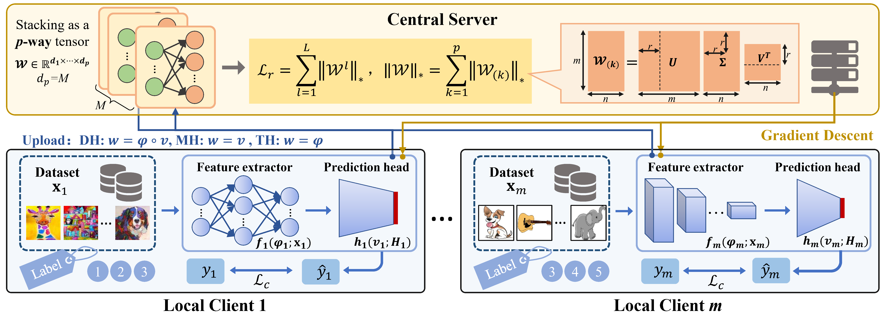

# FedSAK
A Swiss Army Knife for Heterogeneous Federated Multi-Task Learning: Flexible Coupling via Trace Norm

> Submitted to KDD2024

### Abstract

The heterogeneity issue in federated learning (FL) has attracted increasing attention, which is attempted to be addressed by most existing methods. Currently, due to systems and objectives heterogeneity, enabling clients to hold models of different architectures and tasks of different demands has become an important direction in FL. 
Most existing FL methods are based on the homogeneity assumption, namely, different clients have the same architectural models with the same tasks, which are unable to handle complex and multivariate data and tasks. 
To flexibly address these heterogeneity limitations, we propose a novel federated multi-task learning framework with the help of tensor trace norm, FedSAK. Specifically, it treats each client as a task and splits the local model into a feature extractor and a prediction head. 
Clients can flexibly choose shared structures based on heterogeneous situations and upload them to the server, which learns correlations among client models by mining model low-rank structures through tensor trace norm.
Furthermore, we derive convergence and generalization bounds under non-convex settings. Evaluated on 6 real-world datasets compared to 13 advanced FL models, FedSAK demonstrates superior performance.

### Model



Framework of our proposed FedSAK.

### Training & Testing
```
python main.py
```

## Acknowledgements

This repo is based on [FedU](https://github.com/CharlieDinh/FedU_FMTL). 

Thanks to the original authors for their work!